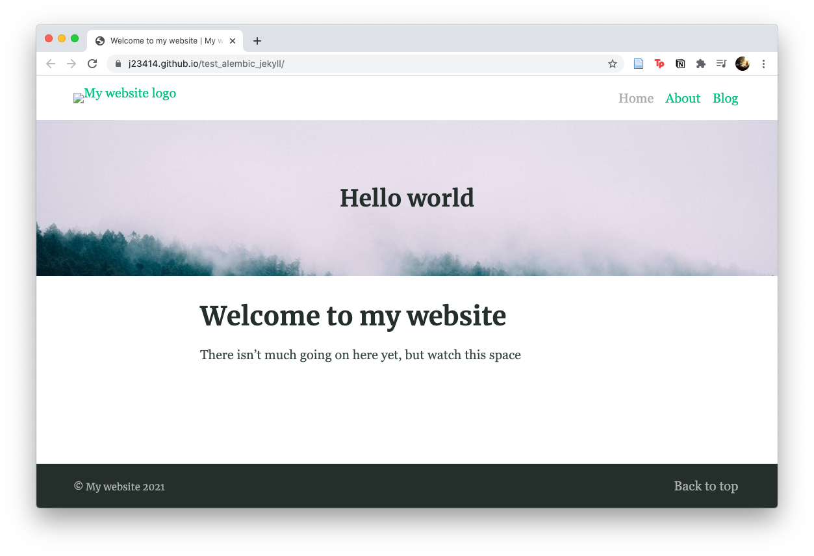

# Checking on Jekyll

Debugging a jekyll site which built fine before Dec 4th 2020 and was broken afterward.

Here, I'm using the same theme to build a blank website. To make sure I understand how this template works to debug the other site.

```
wget https://github.com/daviddarnes/alembic-kit/archive/remote-theme.zip
unzip remote-theme.zip

ls alembic-kit-remote-theme/*

#> alembic-kit-remote-theme/
#>    |_ 404.md
#>    |_ Gemfile
#>    |_ README.md
#>    |_ _config.yml
#>    |_ about.md
#>    |_ categories.md
#>    |_ index.md
#>    |_ _posts/
#>    |   |_ 2018-08-22-hello-world.md
#>    |_ blog:
#     |_ index.html
```

Checking on the file and folder organization

Within `_config.yml`, under "Site settings", fill in values for the `url` and the `base url`

```
# Site settings
url: 'https://j23414.github.io/test_alembic_jekyll/'
baseurl: '/test_alembic_jekyll/'
```

This will allow proper linking of the website stylesheets.

[View live website](https://j23414.github.io/test_alembic_jekyll/)



Works, awesome!

**Solution:** The following change fixed the original broken jekyl site. We needed to point to the "main" branch (by default it looks for "master" branch).

In `_config.yml` change from:

```
remote_theme: daviddarnes/alembic
```

to 

```
remote_theme: daviddarnes/alembic@main
```
